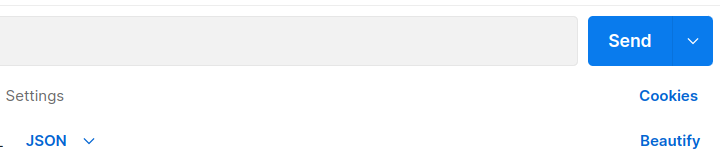
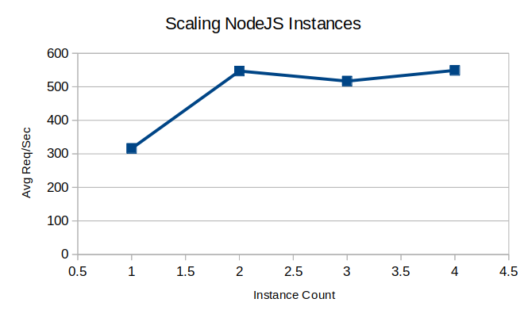

<!--  -->

# Description

Backend of a forum discussion app.

## Unit Testing 

#### Run from top level
    npm i 

#### Run unit tests
    npm run test

# Installation to run locally

- Clone the code to your machine.

- Install the latest version of docker desktop on your system and run it.

- Open a command terminal and execute the following commands in the top level the project.

## To run in Docker

    docker-compose up

# Postman API

The application routes should be available
on http://localhost

I will share access to my Postman API for testing the app  once I get the reviewer(s) email.  
Postman does not support exporting the API as a PDF or HTML.

## Example Usage

### 1. Select API's on the left side and select the "Class Forum" API.

### 2. Select the "Discussion Questions" request collection.

### 3. Select the "Create Question" request.

### 4. Near the top right of the screen select the "No Environment" tab.

### 5. From the dropdown select "localhost".

### 6. Observe the request body to be sent.

### 7. Send the request.

### 8. You will get a 400 error response because that userId does not exist yet. 

### 9. On the API requests on the left side. Open the "Users" colection and select "Create Professor".

### 10. Observe the request body to be sent, then send the request.

### 11. The response at the bottom provides you a "id" for the new user.

### 12. Highlight the id code and copy it. CTRL + C and select the "Create Question" request again.

### 13. Paste the id code in for the value of "userId" of the "Create Question" request and send the request.

### 14. Observe the response. The question was created!

Feel free to explore various requests suchs as replying to a question or 
replying to a reply!

## Performance Benchmarks

Below is a diagram of the initial architechure.

# Initial Architechure

Just a single NodeJS instance container  
and a single MySQL container.

### System Specs

intel Core-i-5300U @ 2.3Ghz 2C/4T  
12GB RAM - Dual Channel  
256SSD  

### Test Case 

HTTP GET request for all discussion questions.  
The database was prepopulated with 140 questions.

The path is: http://localhost/questions/all

### Benchmark 1 - Initial Architechure

2 cores accessable to Docker.  
1 MySQL instance for the database.  
1 NodeJS instance.  

Below it shows that with a single NodeJS instance  
we can serve about 210 Req/Sec on average.

### Benchmark 2 - Nginx Horizontal Scaling 

#### Constants
4 cores accessable to Docker. 
1 MySQL instance for the database. 
1 Nginx instance for load balancing. 

Below we try different numbers of NodeJS instance and measure
the average number of Req/Sec.

| NodeJS Instances    | Avg Req/Sec |
| -------- | ------- |
| 1  | 316    |
| 2 | 547    |
| 3   | 517    |
| 4   | 549    |

Scaling beyond 2 NodeJS instances does not seem to offer any benefit.  
This is likely because the test machine only has 2 physical cores.   Multi-threading does not offer much benefit.

The figure below shows the benchmark results for 
two NodeJS instances.

## Optimized Architechure

## Cache Optimization - At the NodeJS level.

#### Estimating an Upper Bound on Cached Performance

The database call in the GET /questions/all route was removed.
This gives an upper bound on what can be achieved with caching.

| NodeJS Instances    | Avg Req/Sec |
| -------- | ------- |
| 2  | 705    |
| 4  | 719    |

With a simple in-memory cache added on the route.

| NodeJS Instances    | Avg Req/Sec |
| -------- | ------- |
| 2  | 720   |
| 4  | 640    |

Caching does help a lot and we indeed reached the upper
bound with it. There is no significant difference between 
running 2 or 4 NodeJS instances with caching because the standard
deviation is 46 req/sec in the 2 instance case as seen below.

## Cache Optimization - At the Nginx Level

Almost a 6X increase in performance!

The figure below shows how far we have come. Almost 
a 20X increase in performance from the baseline.

Unfortunately Caching API calls at the load balancer isn't a good solution because
for a forum like this, people usually want to see up to date posts.  Caching resulted
in stale data getting served far too often. So caching was turned off.

#### Some possible solutions:

- Implement paging or infinite scrolling so that not all the questions need to be requested at once. 

- Refactor so that fewer database calls are made when loading discussion questions. e.g. One query instead of several.

- Check that the database is using indexing properly. i.e. B-Trees and not linear search. Try writing raw SQL and seeing if that improves performance.

- Scale the database horizontally with replicas as shown in the diagram below.

## Database Read Optimized Architechure

# Future Features:

- User authentication and authorization using JSON Web Tokens.
- Rate limiting 
- Real-time chat like Reddit has.  Maybe in a different language thats better for that task.

## Sources

#### Nginx Load Balancing
https://levelup.gitconnected.com/load-balance-and-scale-node-js-containers-with-nginx-and-docker-swarm-9fc97c3cff81

#### Docker Replicas
https://devops.stackexchange.com/questions/6233/how-to-create-replicas-in-docker-compose-when-scale-is-deprecated

#### Nginx Caching
https://docs.nginx.com/nginx/admin-guide/content-cache/content-caching/

https://stackoverflow.com/questions/9230812/nginx-as-cache-proxy-not-caching-anything

#### Redis Caching
https://www.tomray.dev/nestjs-caching-redis

Copyright 2023 Christopher Kerley